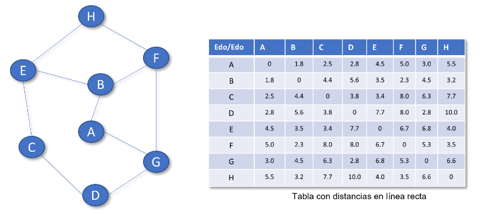

# Proyecto 10 de Sistemas de Búsqueda y Razonamiento

## Descripción del Problema



Debe resolverse este problema utilizando como información la tabla mostrada a la derecha del grafo del problema. Esta tabla indica la distancia en línea recta (dlr) entre cualquier par de estados del problema, esta tabla indica la distancia entre el estado $q0$ y el estado $q1$ de la siguiente manera:

$$dlr(q0, q1) = dlr(q1, q0) = \text{distancia entre } q0 \text{ y } q1$$

La idea es que en este problema el costo del estado $q$ denotado como $g(q)$ se calcula tomando como costo de cambiar entre los estados $q1$ y $q2$ precisamente el valor $dlr(q1, q2)$. Además, el valor heurístico para el estado $q_j$ se calcula como la distancia en línea recta para con el estado meta. Por ejemplo, si la meta es el estado $q_k$ entonces $h(q_i)$, el valor heurístico del estado $q_i$ se calcula como $ℎ(qi) = dlr(q_i, q_k)$ Con esto en mente deberá resolverse este problema usando las siguientes técnicas:

1. Preferente por lo mejor
2. Búsqueda avara
3. Búsqueda A estrella

## Ejecución

Es necesario tener [instalado Python](https://www.python.org/downloads/) para ejecutar de manera local, o [Docker](https://docs.docker.com/engine/install/) para ejecutar el proyecto desde un contenedor.

```bash
git clone https://github.com/MoXcz/python-busqueda
cd python-busqueda

# Docker
docker build -t busqueda .
docker run -it busqueda

# Local
python3 main.py
```

## Integrantes

- Martin Eduardo Chacon Orduño [Chacon0755](https://github.com/Chacon0755).
- Oscar Joaquin Marquez Ortega [Oscar27-22](https://github.com/Oscar27-22).
- ...
